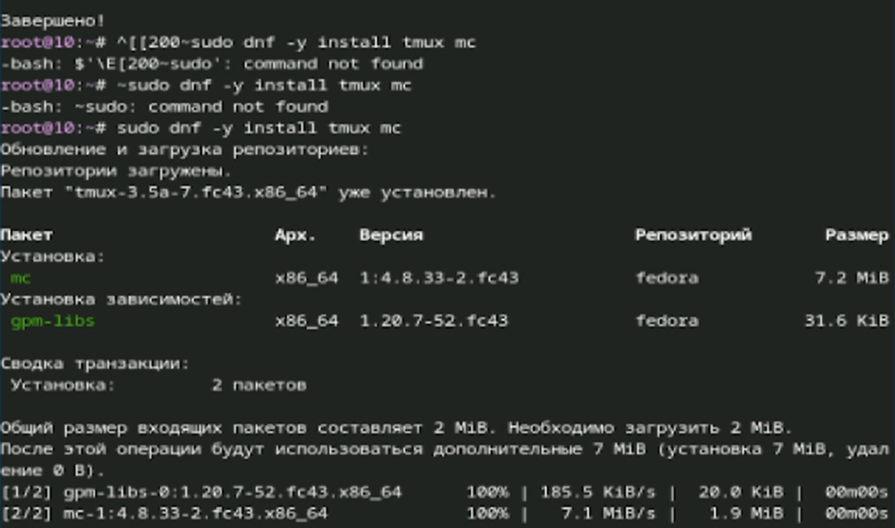
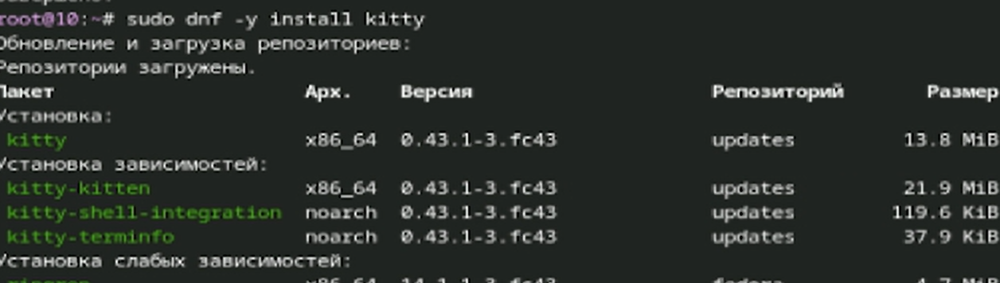
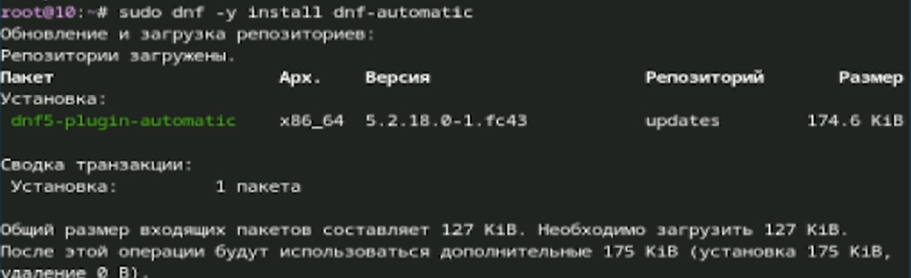
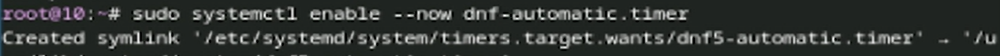
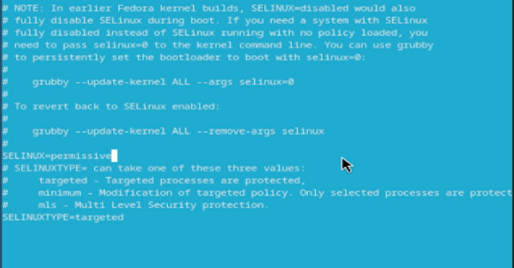
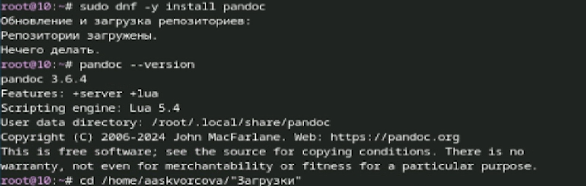
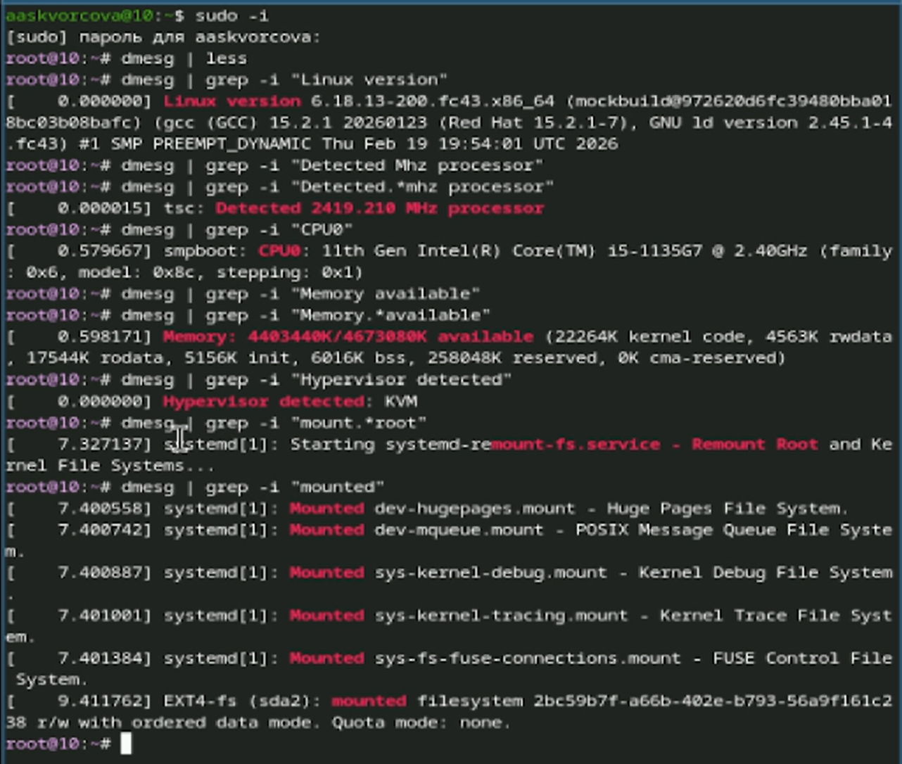

---

## Title
title: "лабораторная работа 1"
subtitle: "дисциплина: Архитектура компьютеров"
author: "Скворцова Анастасия Александровна"

---

# Цель работы

Приобретение практических навыков установки ОС Linux (Fedora Sway) на виртуальную машину и настройки минимально необходимых сервисов.

# Задание

Создать виртуальную машину в VirtualBox (или qemu)

Установить ОС Fedora Sway

Настроить систему согласно требованиям:

Имя пользователя = логин студента в дисплейном классе

Имя хоста = логин студента

Имя виртуальной машины = логин студента

Выполнить базовую настройку:

Установка обновлений

Настройка раскладки клавиатуры (переключение по правому Ctrl)

Отключение SELinux (в permissive mode)

Установка базового ПО (tmux, mc, pandoc, texlive)

# Теоретическое введение

Виртуализация — технология, позволяющая создавать виртуальные версии компьютерных ресурсов (аппаратного обеспечения, ОС, устройств хранения и т.д.). Виртуальная машина (ВМ) эмулирует работу реального компьютера, на который можно установить гостевую ОС.

# Выполнение лабораторной работы

1)На данном этапе показан процесс установки группы пакетов development-tools в Fedora. После входа в систему и открытия терминала (комбинация Win+Enter) была выполнена команда
На изображении видно, что система начала обновление и загрузку репозиториев Fedora 43, включая основной репозиторий, репозиторий openh264 и репозиторий обновлений. Это необходимый этап для подготовки среды разработки, который требуется как при установке дополнений гостевой ОС, так и для дальнейшей работы.

{#fig-001 width=70%}

2)становка программ для удобства работы в консоли (tmux и mc)
На этом изображении запечатлена установка двух важных утилит: tmux (терминальный мультиплексор) и mc (Midnight Commander — файловый менеджер). Видно, что сначала были допущены опечатки при вводе команд (с лишними символами [200~ и ~), но затем команда была выполнена корректно
Система сообщила, что пакет tmux уже установлен, а mc и его зависимость gpm будут установлены. Это соответствует этапу «Повышение комфорта работы» из методических указаний. Установка mc особенно важна для удобной навигации по файловой системе и редактирования конфигурационных файлов.

{#fig-002 width=70%}

3)Установка альтернативного терминала (kitty)
Данное изображение демонстрирует установку эмулятора терминала kitty. Согласно методическим указаниям, это альтернативный вариант консоли для повышения комфорта работы. На изображении видно, что устанавливается не только основной пакет kitty, но и его зависимости: kitty-kitten, kitty-shell-integration, kitty-terminfo. Установка производится из репозитория обновлений (updates).

{#fig-003 width=70%}

4)Установка автоматического обновления (dnf-automatic)
На изображении показана установка пакета для автоматического обновления системы
В Fedora 43 этот пакет называется dnf5-plugin-automatic (преемник dnf-automatic). Система отображает информацию о пакете и подтверждает его установку. Это соответствует разделу «Автоматическое обновление» методических указаний, где рекомендуется настроить автоматическое обновление систем

{#fig-004 width=70%}

5)Включение и запуск таймера автоматического обновления
Это изображение показывает активацию сервиса автоматического обновления
Система сообщает о создании символической ссылки для таймера: /etc/systemd/system/timers.target.wants/dnf5-automatic.timer → /usr/lib/systemd/system/timers.target.wants/dnf5-automatic.timer. Это означает, что таймер настроен на автоматический запуск при загрузке системы и уже активен.

{#fig-005 width=70%}

6)Отключение SELinux (перевод в permissive mode)
На данном изображении показан фрагмент файла /etc/selinux/config после редактирования. В соответствии с методическими указаниями, SELinux отключается (переводится в permissive mode) для упрощения работы в рамках курса. 
Также в файле присутствуют комментарии с информацией о том, как полностью отключить SELinux через параметры ядра, если это необходимо. После этого изменения требуется перезагрузка системы.

{#fig-006 width=70%}

7)становка Pandoc и проверка версии
Изображение демонстрирует установку системы конвертации документов Pandoc

{#fig-007 width=70%}

8)Сбор информации о системе (диагностика)
Это изображение содержит результаты выполнения различных диагностических команд для сбора информации о системеучше

{#fig-008 width=70%}

# Выводы
В ходе выполнения лабораторной работы были приобретены практические навыки установки операционной системы Linux (дистрибутив Fedora Sway) на виртуальную машину и выполнена базовая настройка системы для дальнейшей работы.

# Список литературы

