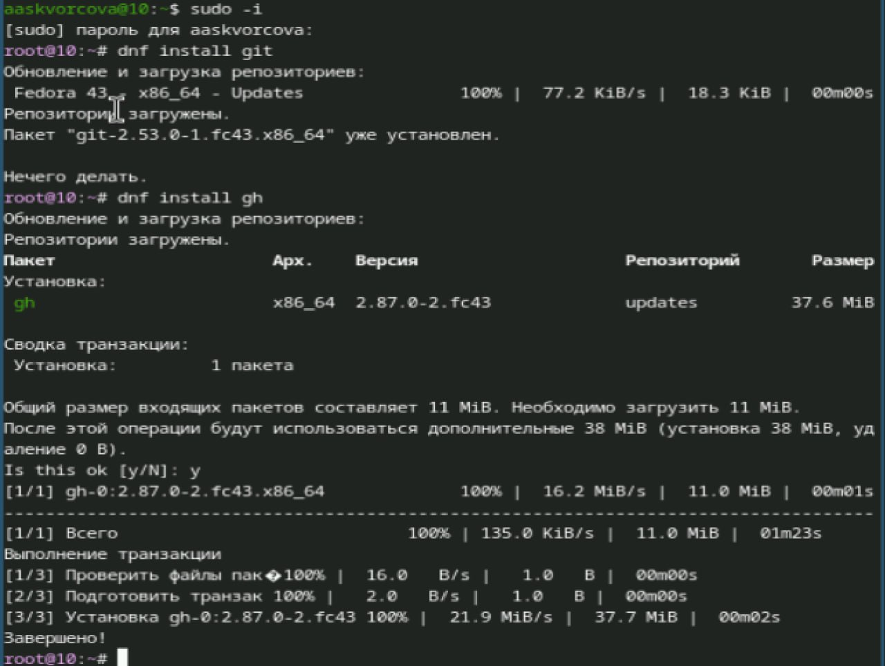
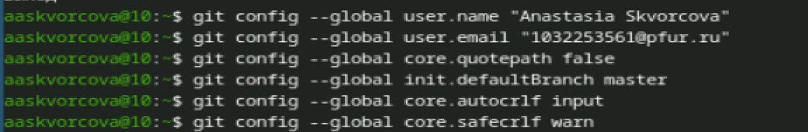
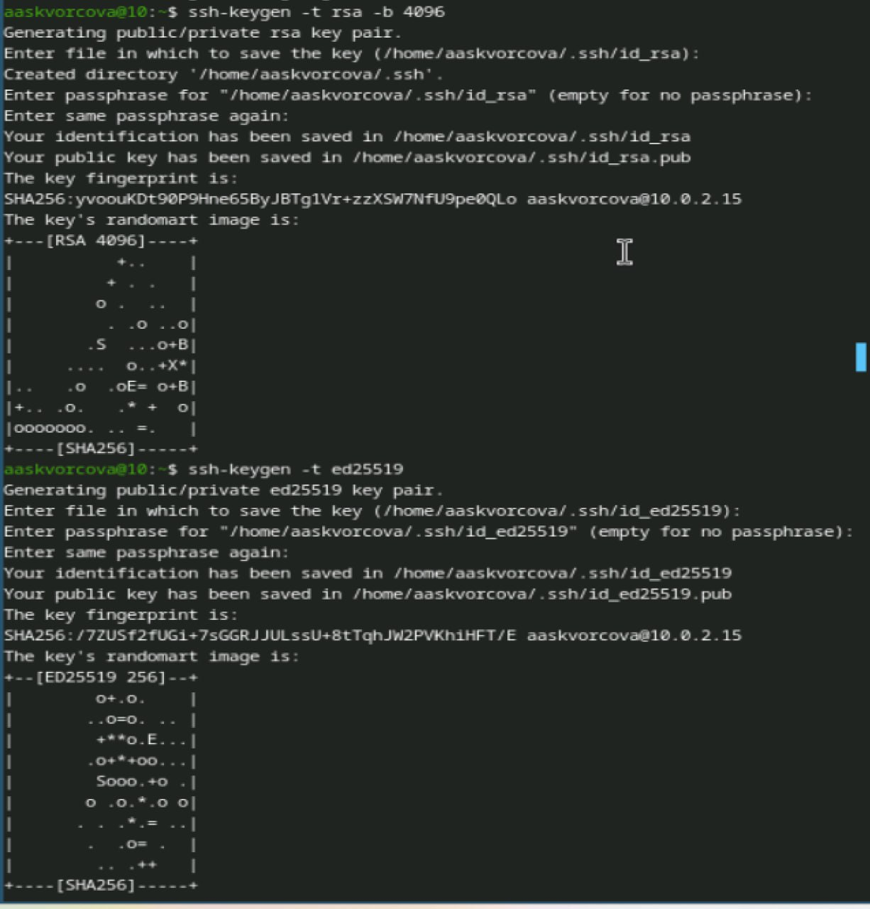
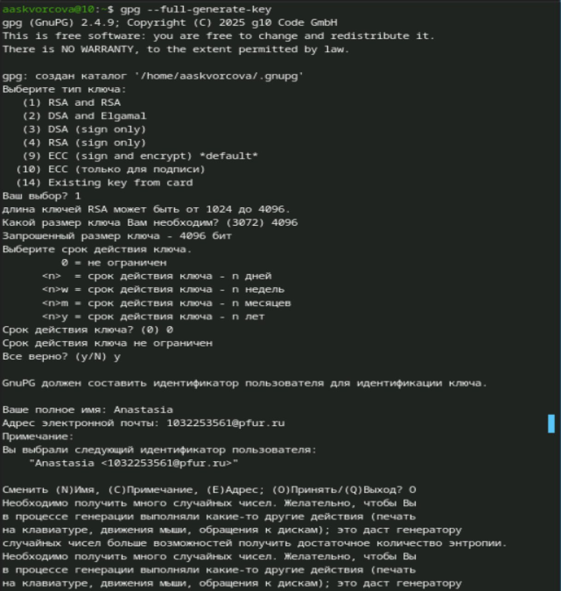
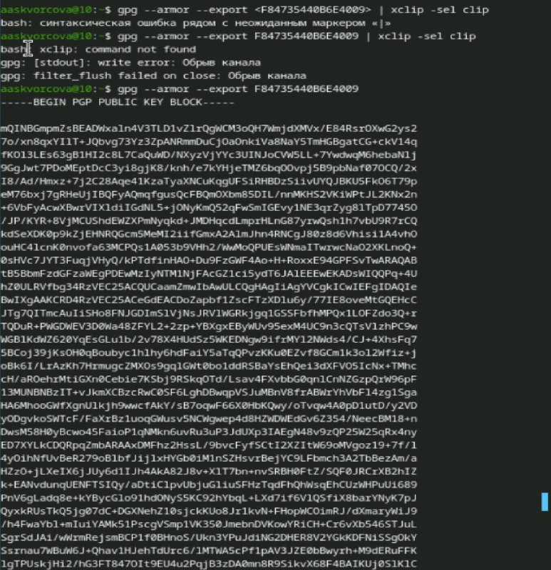
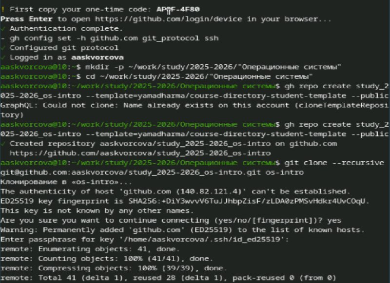
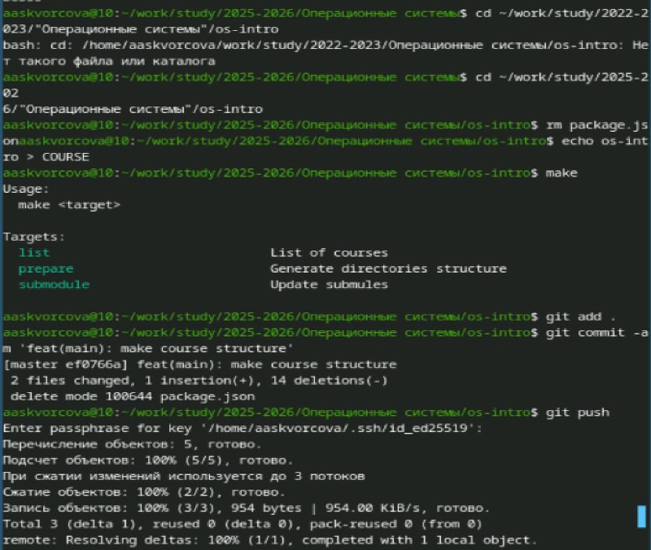

# Цель работы
Изучить идеологию и применение средств контроля версий.
Освоить умения по работе с git.

# Задание
1.Выполнить базовую настройку git (имя, email, параметры autocrlf, safecrlf, имя начальной ветки).
2.Сгенерировать SSH-ключи (RSA 4096 бит и Ed25519).
3.Сгенерировать PGP-ключ для подписи коммитов.
4.Зарегистрироваться на GitHub и добавить PGP-ключ в настройки аккаунта.
5.Настроить автоматическое подписывание коммитов в git.
6.Авторизоваться в утилите gh (GitHub CLI).
7.Создать на основе шаблона публичный репозиторий курса на GitHub.
8.Клонировать созданный репозиторий, выполнить его инициализацию (настройку структуры каталогов) и отправить изменения в удаленный репозиторий.

# Теоретическое введение

Системы контроля версий (VCS) — программные средства для отслеживания изменений файлов, совместной работы над проектами и возврата к более ранним версиям. VCS бывают централизованными (CVS, Subversion) и распределенными (Git, Mercurial).

Git — распределенная система контроля версий, где каждый участник имеет полную копию репозитория локально. Это обеспечивает автономность и надежность хранения данных.

Основные возможности Git:

Фиксация изменений (коммиты)

Создание и слияние веток

Откат к любой версии проекта

Разрешение конфликтов при одновременной работе нескольких пользователей

Аутентификация и безопасность:

SSH-ключи используются для безопасного подключения к удаленным репозиториям без ввода пароля.

PGP-подписи коммитов позволяют подтвердить подлинность автора изменений (верификация на GitHub).

GitHub — веб-сервис для хостинга Git-репозиториев, обеспечивающий совместную работу над проектами.

# Выполнение лабораторной работы

1)Перейдем в суперпользователя и установим git b gh

{#fig-001 width=70%}

2)Зададим имя и email владельца репозитория  c помощью команд "git config --global user.name "Name Surname"" и "git config --global user.email "work@mail"".
Настроим utf-8 в выводе сообщений git c помощью команды "git config --global core.quotepath false"
Настроим верификацию и подписание коммитов git и зададим имя начальной ветки с помощью команды  "git config --global init.defaultBranch master"
Параметр autocrlf: "git config --global core.autocrlf input"
Параметр safecrlf: "git config --global core.safecrlf warn"

{#fig-002 width=70%}

3)по алгоритму rsa с ключём размером 4096 бит:"ssh-keygen -t rsa -b 4096"
по алгоритму ed25519: "ssh-keygen -t ed25519"

{#fig-003 width=70%}

4)Генерируем ключ "gpg --full-generate-key
"
{#fig-004 width=70%}

5)Выводим список ключей и копируем отпечаток приватного ключа: "gpg --list-secret-keys --keyid-format LONG"
Cкопируем наш сгенерированный PGP ключ в буфер обмена: "gpg --armor --export <PGP Fingerprint> | xclip -sel clip"

{#fig-005 width=70%}

6)Используя введёный email, укажите Git применять его при подписи коммитов:
git config --global user.signingkey <PGP Fingerprint>
git config --global commit.gpgsign true
git config --global gpg.program $(which gpg2)

7)Для начала необходимо авторизоваться: "gh auth login"

8)Необходимо создать шаблон рабочего пространства:
"mkdir -p ~/work/study/2022-2023/"Операционные системы""
"cd ~/work/study/2022-2023/"Операционные системы""
"gh repo create study_2022-2023_os-intro --template=yamadharma/course-directory-student-template --public"
"git clone --recursive git@github.com:<owner>/study_2022-2023_os-intro.git os-intro"

{#fig-006 width=70%}

9)Перейдите в каталог курса:"cd ~/work/study/2022-2023/"Операционные системы"/os-intro"
Удалите лишние файлы:"rm package.json"
Создайте необходимые каталоги:"echo os-intro > COURSE","make"
Отправьте файлы на сервер:"git add .","git commit -am 'feat(main): make course structure'","git push"

{#fig-007 width=70%}

# Выводы
В ходе выполнения лабораторной работы были изучены основы работы с системой контроля версий Git. Выполнена базовая настройка Git, сгенерированы SSH и PGP ключи, настроено автоматическое подписывание коммитов. Создана учетная запись на GitHub, произведена интеграция с локальным репозиторием и сформировано рабочее пространство для дальнейшего выполнения лабораторных работ по курсу.

# Список литературы{.unnumbered}

